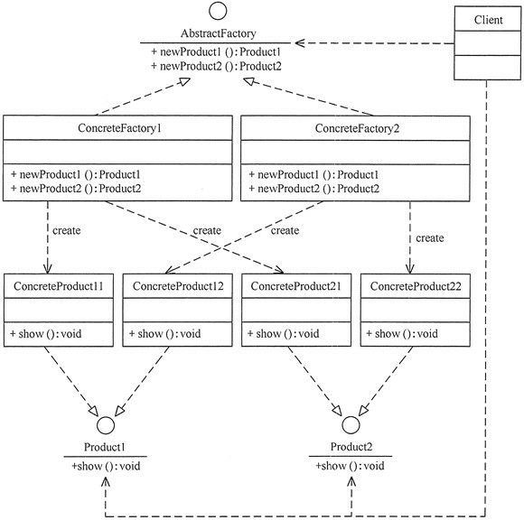

## 抽象工厂模式(Abstract Factory)

抽象工厂模式的结构同工厂方法模式的结构相似，不同的是其产品的种类不止一个，所以创建产品的方法也不止一个。

### 结构图



### 代码示例
```java
public interface Animal {
    /**
     * show
     */
    void show();
}

public class Cattle implements Animal {
    /**
     * show
     */
    @Override
    public void show() {
        System.out.println("动物：牛");
    }
}

public class Horse implements Animal {
    /**
     * show
     */
    @Override
    public void show() {
        System.out.println("动物：马");
    }
}


public interface Plant {
    /**
     * show
     */
    void show();
}

public class Fruits implements Plant {
    /**
     * show
     */
    @Override
    public void show() {
        System.out.println("植物：水果");
    }
}

public class Vegetables implements Plant {
    /**
     * show
     */
    @Override
    public void show() {
        System.out.println("植物：蔬菜");
    }
}

public interface Farm {
    /**
     * 新动物
     *
     * @return Animal
     */
    Animal newAnimal();

    /**
     * 新植物
     *
     * @return Plant
     */
    Plant newPlant();
}

public class SaoGuFarm implements Farm {
    @Override
    public Animal newAnimal() {
        System.out.println("新牛出生！");
        return new Cattle();
    }

    @Override
    public Plant newPlant() {
        System.out.println("蔬菜长成！");
        return new Vegetables();
    }
}

public class ShaRaoFarm implements Farm {
    @Override
    public Animal newAnimal() {
        System.out.println("新马出生！");
        return new Horse();
    }

    @Override
    public Plant newPlant() {
        System.out.println("水果长成！");
        return new Fruits();
    }
}

public class AbstractionFactoryTest {

    @Test
    public void saoGuFarm() {
        Farm f = new SaoGuFarm();
        Animal a = f.newAnimal();
        Plant b = f.newPlant();
        a.show();
        b.show();
    }

    @Test
    public void shaRaoFarm() {
        Farm f = new ShaRaoFarm();
        Animal a = f.newAnimal();
        Plant b = f.newPlant();
        a.show();
        b.show();
    }

}
```

就该例子而言，如果我们需要新增农场的时候只需实现Farm就可以新增，不用修改原来的代码，符合`开闭原则`

但是如果是给Farm接口新增一个类型的时候则需要修改所有的实现类，此时不符合`开闭原则`


