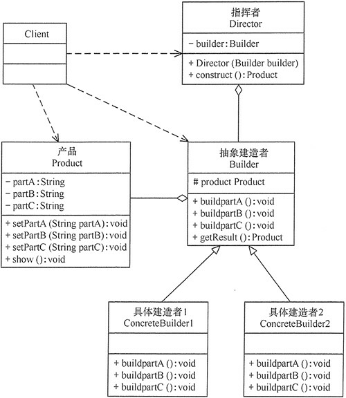

## 建造者模式(Builder)

将一个复杂对象分解成多个相对简单的部分，然后根据不同需要分别创建它们，最后构建成该复杂对象。


将一个复杂对象的构造与它的表示分离，使同样的构建过程可以创建不同的表示，这样的设计模式被称为建造者模式。

### 结构图


### 优点
- 封装性好，构建和表示分离。
- 扩展性好，各个具体的建造者相互独立，有利于系统的解耦。
- 客户端不必知道产品内部组成的细节，建造者可以对创建过程逐步细化，而不对其它模块产生任何影响，便于控制细节风险。

### 缺点
- 产品的组成部分必须相同，这限制了其使用范围。
- 如果产品的内部变化复杂，如果产品内部发生变化，则建造者也要同步修改，后期维护成本较大。

建造者（Builder）模式的主要角色如下。
1. 产品角色（Product）：它是包含多个组成部件的复杂对象，由具体建造者来创建其各个零部件。
2. 抽象建造者（Builder）：它是一个包含创建产品各个子部件的抽象方法的接口，通常还包含一个返回复杂产品的方法 getResult()。
3. 具体建造者(Concrete Builder）：实现 Builder 接口，完成复杂产品的各个部件的具体创建方法。
4. 指挥者（Director）：它调用建造者对象中的部件构造与装配方法完成复杂对象的创建，在指挥者中不涉及具体产品的信息。

### 示例代码
```java
public class Product {
    private String partA;
    private String partB;
    private String partC;

    public void setPartA(String partA) {
        this.partA = partA;
    }

    public void setPartB(String partB) {
        this.partB = partB;
    }

    public void setPartC(String partC) {
        this.partC = partC;
    }

    public void show() {
        //显示产品的特性
        System.out.println(partA);
        System.out.println(partB);
        System.out.println(partC);
    }
}

public abstract class BaseBuilder {
    protected Product product = new Product();

    /**
     * build a
     */
    public abstract void buildPartA();

    /**
     * build b
     */
    public abstract void buildPartB();

    /**
     * build c
     */
    public abstract void buildPartC();

    /**
     * 返回产品对象
     *
     * @return Product
     */
    public Product build() {
        return product;
    }
}

public class ConcreteBuilder extends BaseBuilder{
    @Override
    public void buildPartA() {
        product.setPartA("建造 PartA");
    }

    @Override
    public void buildPartB() {
        product.setPartB("建造 PartB");
    }

    @Override
    public void buildPartC() {
        product.setPartC("建造 PartC");
    }
}

public class Director {
    private BaseBuilder builder;

    public Director(BaseBuilder builder) {
        this.builder = builder;
    }

    /**
     * 产品构建与组装方法
     *
     * @return Product
     */
    public Product construct() {
        builder.buildPartA();
        builder.buildPartB();
        builder.buildPartC();
        return builder.build();
    }
}

public class BaseBuilderTest {

    @Test
    public void demo() {
        BaseBuilder builder = new ConcreteBuilder();
        Director director = new Director(builder);
        Product product = director.construct();
        product.show();
    }

}
```