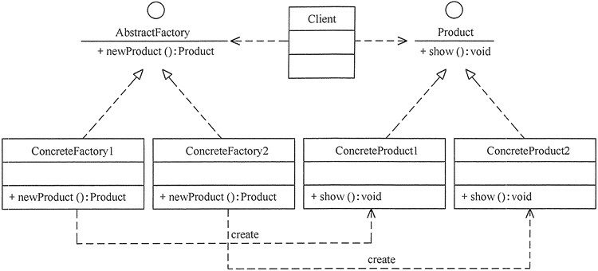

## 工厂方法模式(Factory Method)


### 优点
用户只需要知道具体工厂的名称就可得到所要的产品，无须知道产品的具体创建过程。
灵活性增强，对于新产品的创建，只需多写一个相应的工厂类。
典型的解耦框架。高层模块只需要知道产品的抽象类，无须关心其他实现类，满足迪米特法则、依赖倒置原则和里氏替换原则。

### 缺点
类的个数容易过多，增加复杂度
增加了系统的抽象性和理解难度
抽象产品只能生产一种产品，此弊端可使用抽象工厂模式解决。

## 应用场景
客户只知道创建产品的工厂名，而不知道具体的产品名。如 TCL 电视工厂、海信电视工厂等。
创建对象的任务由多个具体子工厂中的某一个完成，而抽象工厂只提供创建产品的接口。
客户不关心创建产品的细节，只关心产品的品牌

### 结构


### 详细代码

```java

public interface AbstractFactory {
    /**
     * new product
     *
     * @return Product
     */
    Product newProduct();
}

public class FactoryApple implements AbstractFactory {
    @Override
    public Product newProduct() {
        System.out.println("具体工厂 苹果 生成-->具体产品 苹果...");
        return new ProductApple();
    }
}

public class FactoryPear implements AbstractFactory {
    @Override
    public Product newProduct() {
        System.out.println("具体工厂 梨子 生成-->具体产品 梨子 ...");
        return new ProductPear();
    }
}


public interface Product {
    /**
     * show
     */
    void show();
}

public class ProductApple implements Product {
    @Override
    public void show() {
        System.out.println("具体产品 苹果 显示...");
    }
}

public class ProductPear implements Product {
    @Override
    public void show() {
        System.out.println("具体产品 梨子 显示...");
    }
}

public class AbstractFactoryTest {
    @Test
    public void testApple() {
        Product product;
        AbstractFactory abstractFactory;
        abstractFactory = new FactoryApple();
        product = abstractFactory.newProduct();
        product.show();
    }

    @Test
    public void testPear() {
        Product product;
        AbstractFactory abstractFactory;
        abstractFactory = new FactoryPear();
        product = abstractFactory.newProduct();
        product.show();
    }
}

```


