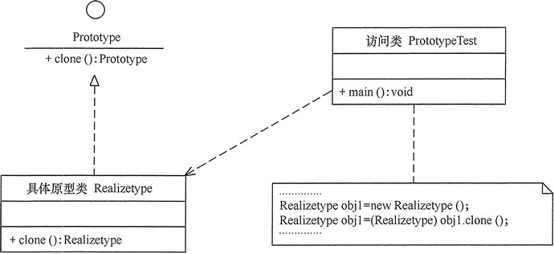

## 原型模式(Prototype)

### 定义
原型（Prototype）模式的定义如下：用一个已经创建的实例作为原型，通过复制该原型对象来创建一个和原型相同或相似的新对象。

### 优点
- Java 自带的原型模式基于内存二进制流的复制，在性能上比直接 new 一个对象更加优良。
- 可以使用深克隆方式保存对象的状态，使用原型模式将对象复制一份，并将其状态保存起来，简化了创建对象的过程，以便在需要的时候使用（例如恢复到历史某一状态），可辅助实现撤销操作。

### 缺点
- 需要为每一个类都配置一个 clone 方法
- clone 方法位于类的内部，当对已有类进行改造的时候，需要修改代码，违背了开闭原则。
- 当实现深克隆时，需要编写较为复杂的代码，而且当对象之间存在多重嵌套引用时，为了实现深克隆，每一层对象对应的类都必须支持深克隆，实现起来会比较麻烦。因此，深克隆、浅克隆需要运用得当。

1. 模式的结构
原型模式包含以下主要角色。
- 抽象原型类：规定了具体原型对象必须实现的接口。
- 具体原型类：实现抽象原型类的 clone() 方法，它是可被复制的对象。
- 访问类：使用具体原型类中的 clone() 方法来复制新的对象。

2. 模式的实现
原型模式的克隆分为浅克隆和深克隆。
- 浅克隆：创建一个新对象，新对象的属性和原来对象完全相同，对于非基本类型属性，仍指向原有属性所指向的对象的内存地址。
- 深克隆：创建一个新对象，属性中引用的其他对象也会被克隆，不再指向原有对象地址。


### 原型模式的应用场景

- 对象之间相同或相似，即只是个别的几个属性不同的时候。
- 创建对象成本较大，例如初始化时间长，占用CPU太多，或者占用网络资源太多等，需要优化资源。
- 创建一个对象需要繁琐的数据准备或访问权限等，需要提高性能或者提高安全性。
- 系统中大量使用该类对象，且各个调用者都需要给它的属性重新赋值。

### 结构



```java
/**
 * 原型模式
 *
 * @author ming
 * @version 1.0.0
 * @date 2020/12/28 9:52
 **/
public class RealizeType implements Cloneable {
    RealizeType() {
        System.out.println("具体原型创建成功！");
    }

    @Override
    public Object clone() throws CloneNotSupportedException {
        System.out.println("具体原型复制成功！");
        return super.clone();
    }
}

```

```java
import org.junit.Test;

/**
 * 原型模式 Test
 *
 * @author ming
 * @version 1.0.0
 * @date 2020/12/28 9:52
 **/
public class RealizeTypeTest {

    @Test
    public void cloneTest() throws CloneNotSupportedException {
        RealizeType obj1 = new RealizeType();
        RealizeType obj2 = (RealizeType) obj1.clone();
        System.out.println(String.format("obj1==obj2 ? %s", (obj1 == obj2)));
    }
}
```

### 原型管理
```java

interface Shape extends Cloneable {
    /**
     * copy
     *
     * @return Object
     */
    Object clone();

    /**
     * countArea
     */
    void countArea();
}

public class Circle implements Shape {

    private Integer r;

    Circle() {

    }

    public Circle setRadius(Integer r) {
        this.r = r;
        return this;
    }

    @Override
    public Object clone() {
        Circle w = null;
        try {
            w = (Circle) super.clone();
        } catch (CloneNotSupportedException e) {
            System.out.println("Clone Circle failed!!");
        }
        return w;
    }

    @Override
    public void countArea() {
        if (null == r) {
            System.out.println("Please set radius!!");
        }
        System.out.println(String.format("The circle Area = %s", (3.1415 * r * r)));
    }
}

public class Square implements Shape {
    private Integer a;

    Square() {

    }

    public Square setSideLength(Integer a) {
        this.a = a;
        return this;
    }

    /**
     * copy
     *
     * @return Object
     */
    @Override
    public Object clone() {
        Square square = null;
        try {
            square = (Square) super.clone();
        } catch (CloneNotSupportedException e) {
            System.out.println("Clone Square failed!!");
        }
        return square;
    }

    /**
     * countArea
     */
    @Override
    public void countArea() {
        if (null == a) {
            System.out.println("Please set Side length of Square!!");
        }
        System.out.println(String.format("The Square Area = %s", (a * a)));
    }
}

public class ProtoTypeManager {
    private HashMap<String, Shape> ht = new HashMap<>();

    ProtoTypeManager() {
        ht.put("Circle", new Circle());
        ht.put("Square", new Square());
    }

    public void addShape(String key, Shape obj) {
        ht.put(key, obj);
    }

    public Shape getShape(String key) {
        Shape temp = ht.get(key);
        return (Shape) temp.clone();
    }
}

public class ProtoTypeManagerTest {
    @Test
    public void test() {
        ProtoTypeManager pm = new ProtoTypeManager();
        Circle circle = (Circle) pm.getShape("Circle");
        circle.setRadius(2).countArea();
        Square square = (Square) pm.getShape("Square");
        square.setSideLength(10).countArea();
    }
}
```


