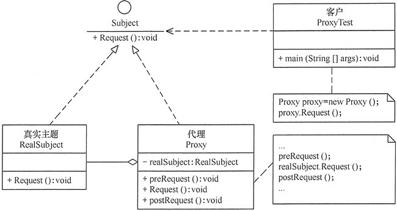

## 代理模式(Proxy)

为某对象提供一种代理以控制对该对象的访问。即客户端通过代理间接地访问该对象，从而限制、增强或修改该对象的一些特性。
### 结构图

- 代理模式的主要优点有：
1. 代理模式在客户端与目标对象之间起到一个中介作用和保护目标对象的作用；
2. 代理对象可以扩展目标对象的功能；
3. 代理模式能将客户端与目标对象分离，在一定程度上降低了系统的耦合度，增加了程序的可扩展性

- 其主要缺点是：
1. 代理模式会造成系统设计中类的数量增加
2. 在客户端和目标对象之间增加一个代理对象，会造成请求处理速度变慢；
3. 增加了系统的复杂度；

根据代理的创建时期，代理模式分为静态代理和动态代理。
- 静态：由程序员创建代理类或特定工具自动生成源代码再对其编译，在程序运行前代理类的 .class 文件就已经存在了。
- 动态：在程序运行时，运用反射机制动态创建而成

