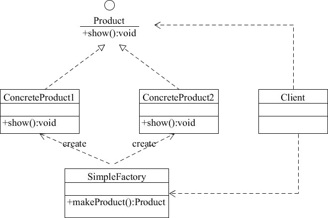

## 简单工厂模式(SimpleFactory)
简单工厂（SimpleFactory）：是简单工厂模式的核心，负责实现创建所有实例的内部逻辑。工厂类的创建产品类的方法可以被外界直接调用，创建所需的产品对象。

### 优点
- 工厂类包含必要的逻辑判断，可以决定在什么时候创建哪一个产品的实例。客户端可以免除直接创建产品对象的职责，很方便的创建出相应的产品。工厂和产品的职责区分明确。
- 客户端无需知道所创建具体产品的类名，只需知道参数即可。
- 也可以引入配置文件，在不修改客户端代码的情况下更换和添加新的具体产品类。

### 缺点
- 简单工厂模式的工厂类单一，负责所有产品的创建，职责过重，一旦异常，整个系统将受影响。且工厂类代码会非常臃肿，违背高聚合原则。
- 使用简单工厂模式会增加系统中类的个数（引入新的工厂类），增加系统的复杂度和理解难度
- 系统扩展困难，一旦增加新产品不得不修改工厂逻辑，在产品类型较多时，可能造成逻辑过于复杂
- 简单工厂模式使用了 static 工厂方法，造成工厂角色无法形成基于继承的等级结构。

### 应用场景
对于产品种类相对较少的情况，考虑使用简单工厂模式。使用简单工厂模式的客户端只需要传入工厂类的参数，不需要关心如何创建对象的逻辑，可以很方便地创建所需产品。

### 结构图


```java
public interface Product {
    /**
     * show
     */
    void show();
}

public class Const {
    static final int PRODUCT_A = 0;
    static final int PRODUCT_B = 1;
}

public class AppleProduct implements Product {
    @Override
    public void show() {
        System.out.println("具体产品 -> 苹果 <- 显示...");
    }
}

public class PearProduct implements Product {
    @Override
    public void show() {
        System.out.println("具体产品 -> 梨子 <- 显示...");
    }
}

public class SimpleFactory {
    public static Product makeProduct(int kind) {
        switch (kind) {
            case Const.PRODUCT_A:
                return new AppleProduct();
            case Const.PRODUCT_B:
                return new PearProduct();
            default:
                return null;
        }
    }
}

public class SimpleFactoryTest {

    @Test
    public void makeProduct0() {
        Product product = SimpleFactory.makeProduct(0);
        if (null != product) {
            product.show();
        }
    }

    @Test
    public void makeProduct1() {
        Product product = SimpleFactory.makeProduct(1);
        if (null != product) {
            product.show();
        }
    }
}
```


