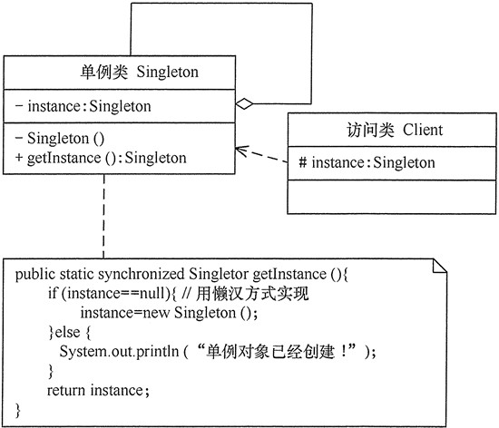

## 单例模式(Singleton)

### 结构图



### 懒汉式
```java
/**
 * 单例模式 - 懒汉式
 *
 * @author ming
 * @version 1.0.0
 * @date 2020/12/25 17:05
 **/
public class SingletonLazybones {
    /**
     * 1. 本类内部创建对象实例
     */
    private static SingletonLazybones instance = null;

    /**
     * 2. 构造方法私有化，外部不能new
     */
    private SingletonLazybones() {

    }

    /**
     * 3. 提供一个公有的静态方法，返回实例对象
     */
    private static SingletonLazybones newInstance() {
        if (null == instance) {
            instance = new SingletonLazybones();
        }
        return instance;
    }

    private void print() {
        System.out.println(this);
    }

    public static void main(String[] args) {
        SingletonLazybones.newInstance().print();
        SingletonLazybones.newInstance().print();
    }

}
```

但是上面的写法是不安全的,下面给出了安全的是写法。

### 懒汉式 - 双重检查加锁
```java
/**
 * 单例模式 - 懒汉式 (双重检查加锁)
 *
 * @author ming
 * @version 1.0.0
 * @date 2020/12/25 17:23
 **/
public class SingletonLazybonesDoubleCheck {
    private volatile static SingletonLazybonesDoubleCheck instance = null;

    private SingletonLazybonesDoubleCheck() {

    }

    public static SingletonLazybonesDoubleCheck newInstance() {
        if (null == instance) {
            synchronized (SingletonLazybonesDoubleCheck.class) {
                if (null == instance) {
                    instance = new SingletonLazybonesDoubleCheck();
                }
            }
        }
        return instance;
    }

}
```

### 饿汉式

```java
/**
 * 饿汉式 - 空间换时间
 *
 * @author ming
 * @version 1.0.0
 * @date 2020/12/25 17:31
 **/
public class SingletonHungry {
    private static SingletonHungry instance = new SingletonHungry();

    private SingletonHungry() {

    }

    public static SingletonHungry newInstance() {
        return instance;
    }
}
```

### 静态内部类
```java
/**
 * 单例模式 - 静态内部类
 *
 * @author ming
 * @version 1.0.0
 * @date 2020/12/25 17:39
 **/
public class SingletonStaticInnerClass {
    private static class Singleton {
        /**
         * 静态初始化器，由JVM来保证线程安全
         */
        private static SingletonStaticInnerClass instance = new SingletonStaticInnerClass();
    }

    private SingletonStaticInnerClass() {
    }

    public static SingletonStaticInnerClass newInstance() {
        return Singleton.instance;
    }

}
```

### 破坏单例模式的三种方式
1. 反射
2. 序列化
3. 克隆

### 如何避免单例被破坏

1. 防止反射 (定义一个全局变量，当第二次创建的时候抛出异常)
2. 防止克隆破坏 (重写clone(),直接返回单例对象)
3. 防止序列化破坏 (添加readResolve(),返回Object对象)
```java
public class SingletonLazybonesDoubleCheck {
    private volatile static SingletonLazybonesDoubleCheck instance = null;

    private SingletonLazybonesDoubleCheck() {

    }

    public static SingletonLazybonesDoubleCheck newInstance() {
        if (null == instance) {
            synchronized (SingletonLazybonesDoubleCheck.class) {
                if (null == instance) {
                    instance = new SingletonLazybonesDoubleCheck();
                }
            }
        }
        return instance;
    }

    @Override
    protected Object clone() throws CloneNotSupportedException {
        return instance;
    }

    /**
     * 防止序列化破环
     */
    private Object readResolve() {
        return instance;
    }

}
```
   
